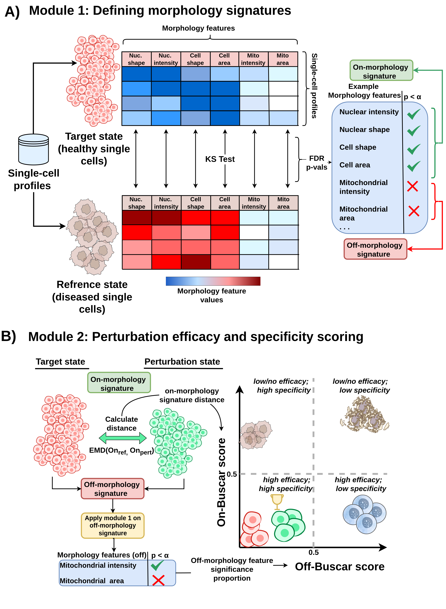

# Buscar


## About

Buscar (Bioactive Unbiased Single-cell Compound Assessment and Ranking) is an open-source Python package for reproducible perturbation hit calling in high-content screening that operates directly on distributions of single-cell image-based profiles. The name is also a play on the Spanish and Portuguese verb "buscar," meaning "to search" or "to seek," reflecting the framework's core goal of identifying biologically active perturbations. Traditional high-content screening approaches rely on population-based aggregated profiles to evaluate compound-induced morphological activity, which obscures the biological heterogeneity present across individual cells within a treatment group. Buscar addresses this limitation by operating directly on single-cell profiles, enabling a more nuanced and interpretable assessment of perturbation activity.

Buscar requires two reference populations defining distinct morphology states, for example diseased and healthy cells. It uses these populations to separate the high-dimensional feature space into two complementary, mutually exclusive signatures: an on-morphology signature (features that differ significantly between the reference and target states) and an off-morphology signature (features that remain unchanged). This separation enables the independent tracking of perturbation efficacy and specificity for every perturbation in a given screen. Buscar is designed to be compatible with the Cytomining Ecosystem, ensuring seamless interoperability with tools like Pycytominer, coSMicQC, and CytoTable. All analysis conducted in this project can be found in the notebooks/ directory.

## Implementation

> **Figure:** Figure: Schematic overview of the Buscar framework, highlighting its two main modules and their roles in perturbation hit calling.

| Module | Description |
| --- | --- |
| Defining morphology signatures | Establishes the morphology reference for evaluating perturbations by comparing two control populations: a reference state (e.g., disease cells) and a target state (e.g., healthy cells). Non-parametric statistical tests (e.g., Kolmogorov-Smirnov test) are applied per feature with FDR correction to assign features to either an on-morphology signature (features significantly altered between states) or an off-morphology signature (features that remain unchanged). These signatures define which morphologies must change for a perturbation to achieve efficacy and which serve as indicators of off-target activity. |
| Perturbation efficacy and specificity scoring | Scores each perturbation by computing two complementary metrics. The on-Buscar score quantifies efficacy by measuring the Earth Mover's Distance (EMD) between the perturbed and target single-cell populations using the on-morphology signature features, where a lower score indicates greater phenotypic rescue. The off-Buscar score quantifies specificity by measuring the proportion of off-morphology signature features that become significantly altered under perturbation, where a lower score indicates fewer off-target effects.
## How to install

### 1. Clone the Repository

Start by cloning the buscar repository and navigating into the project directory:

```bash
git clone https://github.com/WayScience/buscar.git
cd buscar
```

### 2. Set Up a Conda Environment

Create and activate a dedicated Conda environment for buscar:

```bash
conda create -n buscar python=3.12
conda activate buscar
```

### 3. Install Poetry

Install Poetry within your Conda environment to manage project dependencies:

```bash
conda install poetry
```

### 4. Install Project Dependencies

With Poetry installed and your environment activated, install all required dependencies:

```bash
poetry install
```

This command will set up all packages as specified in the `pyproject.toml` and `poetry.lock` files.

## Notes

**Parallel Processing Issue**: The `on-Buscar` score utilizes Earth Mover's Distance (EMD) via the [Python Optimal Transport (POT)](https://github.com/PythonOT/POT) library. There is a [known upstream issue](https://github.com/PythonOT/POT/issues/698) where multithreading significantly degrades performance, causing calculations to be extremely slow.

**Recommendation**: We strongly recommend running `on-Buscar` scoring in **single-threaded mode** until this is resolved in the core `POT` library.
